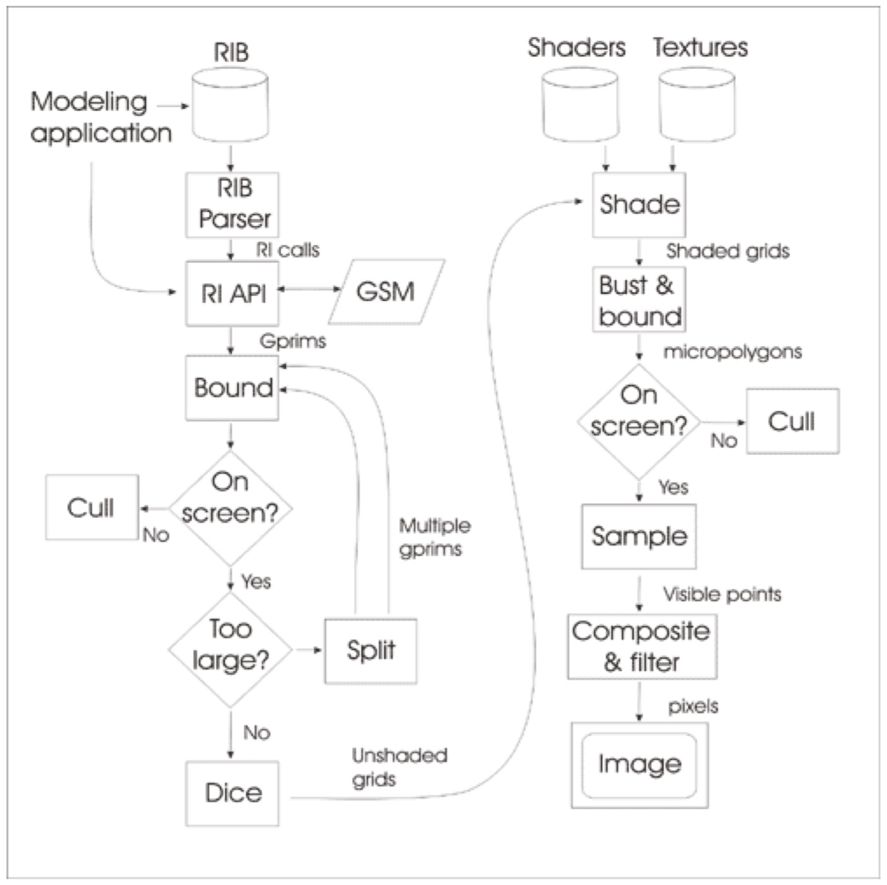
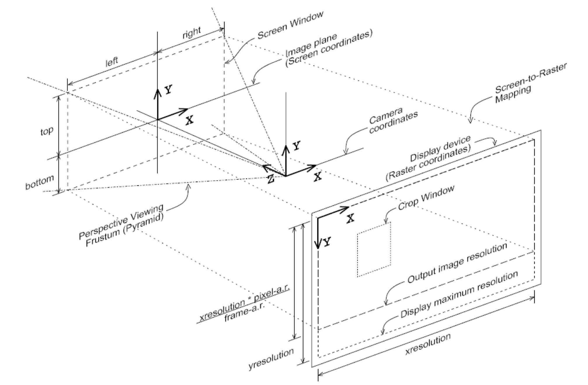
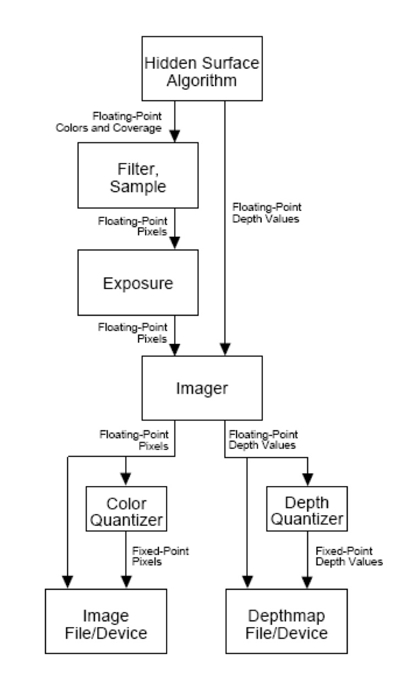
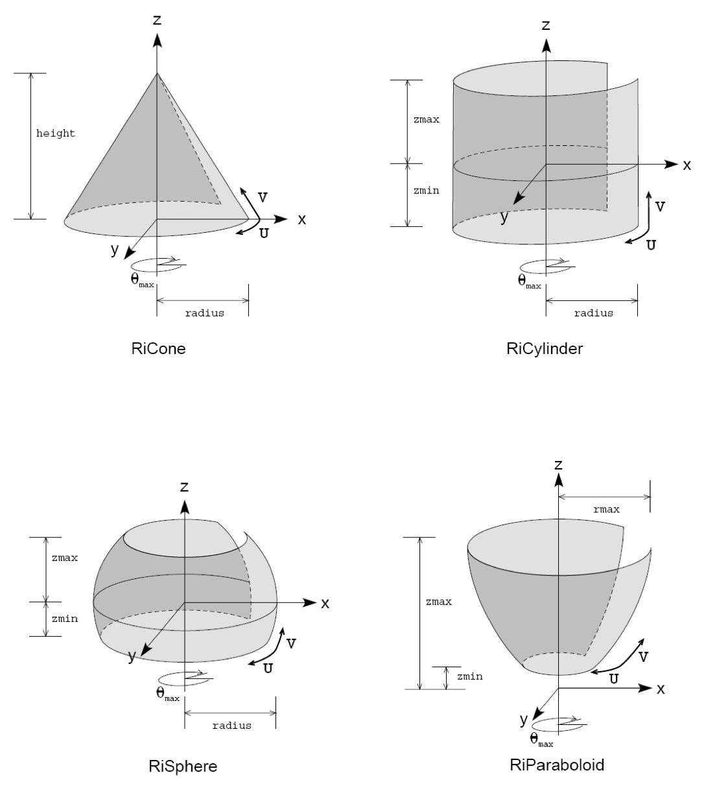
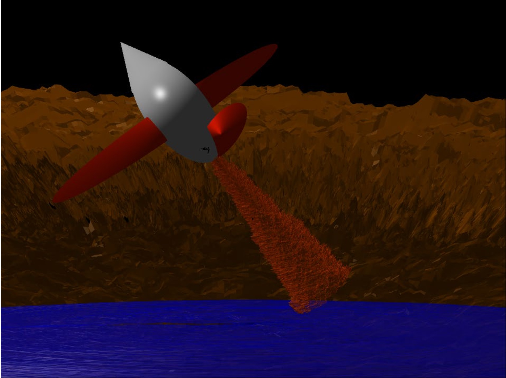
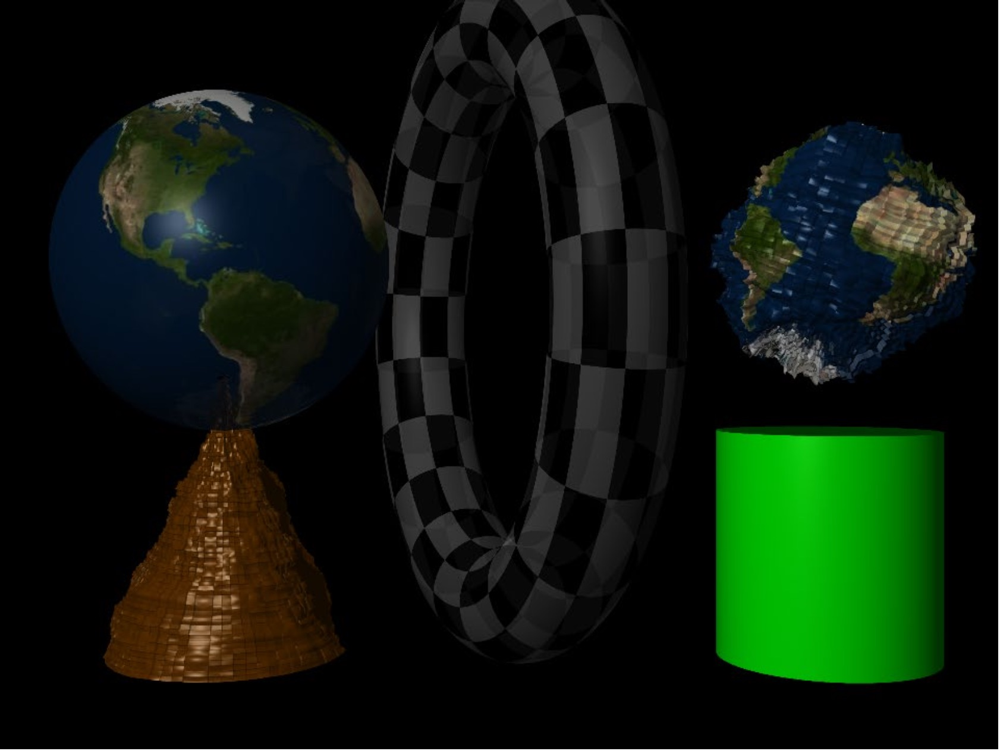

+++
# Date this page was created.
date = 2018-11-10T00:00:00
layout = "project"

# Project title.
title = "2. A RenderMan Graphics Interface"

# Project summary to display on homepage.
summary = """
 This is the curriculum project in CS285 Advanced Image Synthesis at UCSB. 
 I'm responsible for all the code and pipeline design
 """
 
image_preview = "featured.jpeg"

# Tags: can be used for filtering projects.
# Example: `tags = ["Computer Graphics", "Rendering"]`
tags = ["Computer Graphics","Rendering"]

# Optional external URL for project (replaces project detail page).
external_link = ""

# [header]
# image = "featured.jpeg"

+++

# Overview
This is a Reyes-style, micropolygon-based architecture that processes input through a RenderMan-like C interface. It contains the main parts of a fully functional RenderMan interface.   
I independently accomplished it under the guidance of Prof. Pradeep Sen  

The main process of the program is as follows:  
1. Read the Metafile format RIB (Renderman Interface Bytestream) .  
2. Initialize framebuffer, viewer position, world coordinate system, etc.. 
3. Start the scene description.
4. Rasterize scene objects.
5. End the frame.

# Features
## Main Rendering Pipeline Design
The overall rendering pipeline are based on the Renderman interface standard. I implemented most parts of the Renderman pipeline descripted as follows:

And the camera setting is descripted below, which is different as OpenGL.

## Rasterizer
For short, it is able to set up a rudimentary graphics state, render primitives with bound shaders, and determine the visibility using a z-buffer algorithm. Rendering primitives in a Reyes architecture involves dicing them up into a micropolygon grid, shading the grid, and then busting up the grid into micropolygons that are bounded and sampled into screen space locations. 

### Textures
I used OpenCV to read the image file and conveyed it to textures. Then, I use the (u,v) coordinates (which are parameterized from 0 to 1) as the (s,t) coordinates for the texture lookup.

### Transparency
I kept a sorted linked list at each sample in the framebuffer, where micropolygons are sorted with respect to their distance from the camera. When an opaque object is inserted into the list, it clears out the remaining items from the rest of the list, because that opaque sample effectively blocks the rest of the samples. 

# Test Scenes

